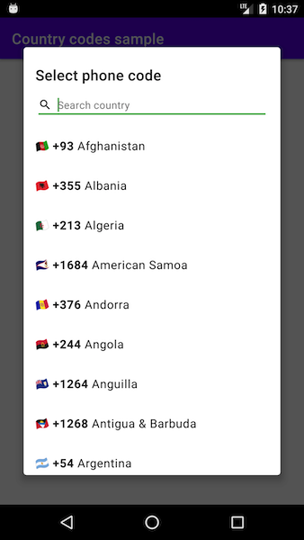

# ChiliCountryCodes

Country phone code repository, detection and lookup library.

* Build on coroutines for asynchronous loading and lookup
* Bundles pre-defined list of [country phone codes](https://en.wikipedia.org/wiki/List_of_country_calling_codes) and allows to provide custom list
* Optional Rx2 wrapper for seamless integration
* Optional UI extension for quick country phone code selection

Made with ❤️ by [Chili Labs](https://chililabs.io).

## Setup

Work in progress

## Usage

Repository initialisation:

```kotlin
// Most basic case with bundled country list
val defaultRepository = CountryRepository.fromAssets(this)

// Loading custom file (assuming it is in same format as bundled file)
val customFileRepository = CountryRepository.fromAssets(this, "custom-list.txt")

// Completely custom repository with custom provider
class SupportedCountryListProvider : CountryListProvider {
  override fun getCountries() = listOf(
    Country("LT", "370", "Lithuania"),
    Country("LV", "371", "Latvia"),
    Country("EE", "372", "Estonia")
  )
}

val customFileRepository = CountryRepository(
    appContext = applicationContext,
    provider = SupportedCountryListProvider(),
    defaultCountry = Country("LV", "371", "Latvia")
)
```

Basic usage without any extensions (note that all calls are suspend functions)

```kotlin
lifecycleScope.launchWhenCreated {
  repository.countries()
    .shuffled()
    .take(5)
    .map { c -> Log.d("CoroutinesExample", c.toString()) }
}

lifecycleScope.launchWhenCreated {
  repository.detectCountry()
    .let { Log.d("CoroutinesExample", "Detected: $it") }
}

lifecycleScope.launchWhenCreated {
  repository.countryWithIsoCode("lv")
    .let { Log.d("CoroutinesExample", "Latvian country code: ${it.phoneCode}") }
}
```

## Rx2 wrapper usage

```kotlin
val disposable = CompositeDisposable()

// Wrap actual repository with Rx repository
val rxRepository = RxCountryRepository(CountryRepository.fromAssets(this))

rxRepository.countries()
  .subscribe { list -> list.map { c -> Log.d("RxExample", c.toString()) } }
  .let { disposable.add(it) }

rxRepository.detectCountry()
  .subscribe { detected -> Log.d("RxExample", "Detected: $detected") }
  .let { disposable.add(it) }

rxRepository.countryWithIsoCode("lv")
  .subscribe { country -> Log.d("RxExample", "Found: $country") }
  .let { disposable.add(it) }

// When cleaning up in lifecycle
if (!disposable.isDisposed) {
  disposable.dispose()
}
```

## Picker dialog extension



```kotlin
// Picker will create its own repository if custom one is not provided.
CountryCodePicker.showDialog(supportFragmentManager, R.style.CustomCodePickerTheme)
```

In case it is important to have single instance of the repository or if custom repository/provider is used:

```kotlin
val repository = CountryRepository.fromAssets(this)
CountryCodePicker.setCustomRepository(repository)

CountryCodePicker.showDialog(supportFragmentManager)
```

Dialog styling is done via custom theme that can be provided as an optional parameter to `showDialog()`

```xml
<!-- All custom fields with their default values -->
<style name="CountryCodePicker.Base" parent="Theme.MaterialComponents.Light">
  <item name="countryCodePicker_BackgroundColor">?colorBackgroundFloating</item>
  <item name="countryCodePicker_SearchTextColor">@color/textPrimary</item>
  <item name="countryCodePicker_HintTextColor">@color/textSecondary</item>
  <item name="countryCodePicker_AccentColor">@color/accentColor</item>
  <item name="countryCodePicker_TitleTextAppearance">?textAppearanceHeadline6</item>
  <item name="countryCodePicker_HintTextAppearance">?textAppearanceBody2</item>
  <item name="countryCodePicker_ItemTextAppearance">?textAppearanceBody1</item>
  <item name="countryCodePicker_TitleText">@string/phone_code_picker_title</item>
  <item name="countryCodePicker_HintText">@string/phone_code_picker_hint</item>
  <item name="countryCodePicker_SearchIcon">@drawable/ic_search</item>
  <item name="countryCodePicker_CornerRadius">4dp</item>
</style>
```

## License

```
Copyright 2020 Chili Labs

Licensed under the Apache License, Version 2.0 (the "License");
you may not use this file except in compliance with the License.
You may obtain a copy of the License at

   http://www.apache.org/licenses/LICENSE-2.0

Unless required by applicable law or agreed to in writing, software
distributed under the License is distributed on an "AS IS" BASIS,
WITHOUT WARRANTIES OR CONDITIONS OF ANY KIND, either express or implied.
See the License for the specific language governing permissions and
limitations under the License.
```